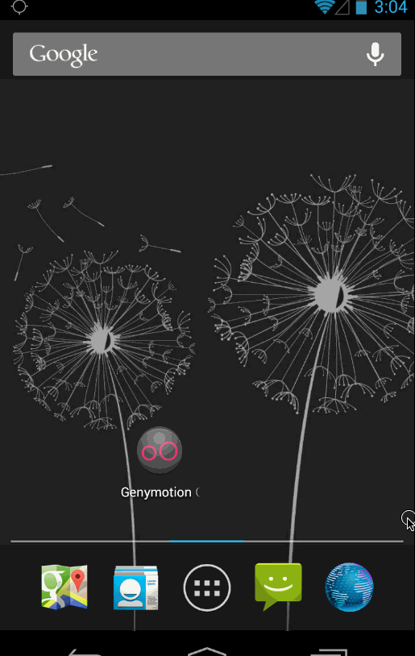

About OneBrick
===============
One Brick provides support to local non-profit and community organizations by creating a unique, social and flexible volunteer environment for those interested in making a concrete difference in the community. We enable people to get involved, have an impact and have fun, without the requirements of individual long-term commitments.

About The App
==================
OneBrick does not yet have any mobile application. Our goal is to prvide onebrick users/volunteers with android mobile application.

User Stories
==============

### Browse:
* Select Chapter (Location)
* Browse current events (API Ready)
* Tap to see details of an event (API Ready)

### RSVP:
* Show events for selected chapter or current location (API Ready)
* Go to detail view
* RSVP
* Request log in if not logged in / Sign up

### Un-RSVP:
* Go to Drawer (Profile)
* History
* Un-RSVP

### Donate:
* Go to Drawer (Profile)
* Donate to organization

### Profile:
* Look at history of events RSVPed
* Name and details

### Share:
* Event, RSVP

User Stories - Implemented End of Sprint 2
============================================
### Login
* [x] User can login to the app using username and password.

### Consumption of Data - View Items
* [x] User can select a chapter from the list of available chapters
* [x] After chapter selection user can see the list of events in the chapter
* [x] User can click on an event to see more details on the event.
* [x] In the more detailed view users can see the address date and time of the event.
* [x] User can also view the small map on the location
* [x] User can click on a "Learn More >" icon to get a detailed description of the event.
* [x] User can click on the small map region to get a big map view.

### Take action on the consumed data
* [x] User can RSVP for an event. 
* [x] User can also Un-RSVP to already RSVP-ed events.
* [x] User can click on the calendar icon to add the event to his local calendar on the phone

### Profile
* [x] User can click on "MyEvents" to see the list of events that he has RSVP-ed only.
* [x] This list changes when the users RSVP changes.

### Social
* [x] User can share the event on Facebook.
* [x] User can share the event on Twitter.
* [x] User can also share the event on other ways like Message, Email, etc.

##App Demo : End of Sprint 2
### App Walkthrough Demo

### App Walkthrough -  Share Event 

