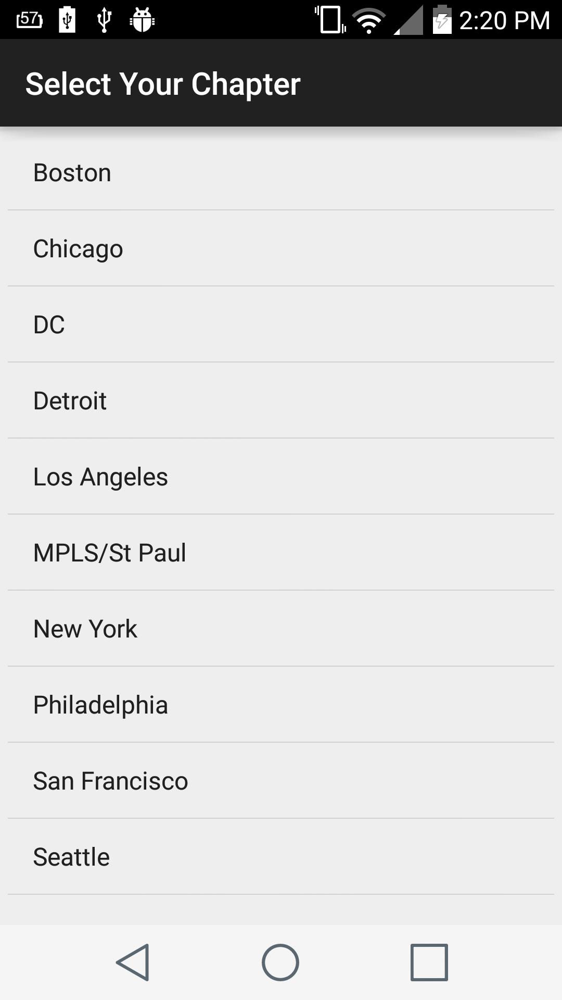
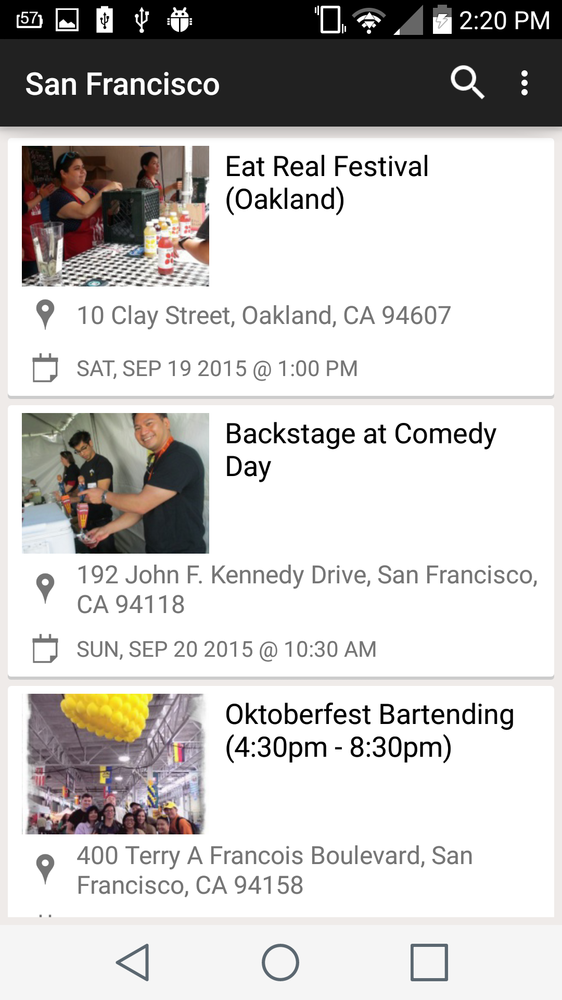
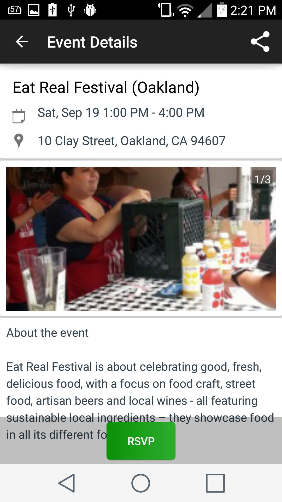
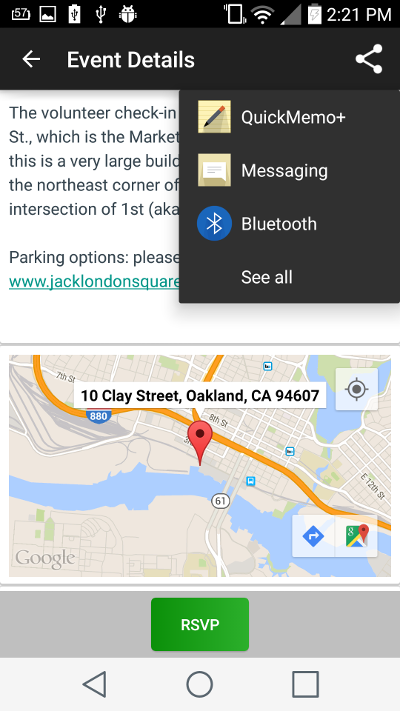
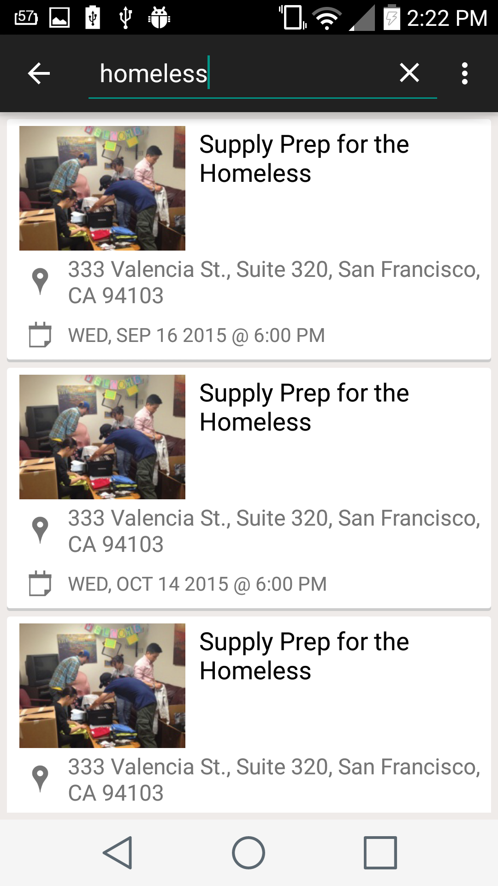
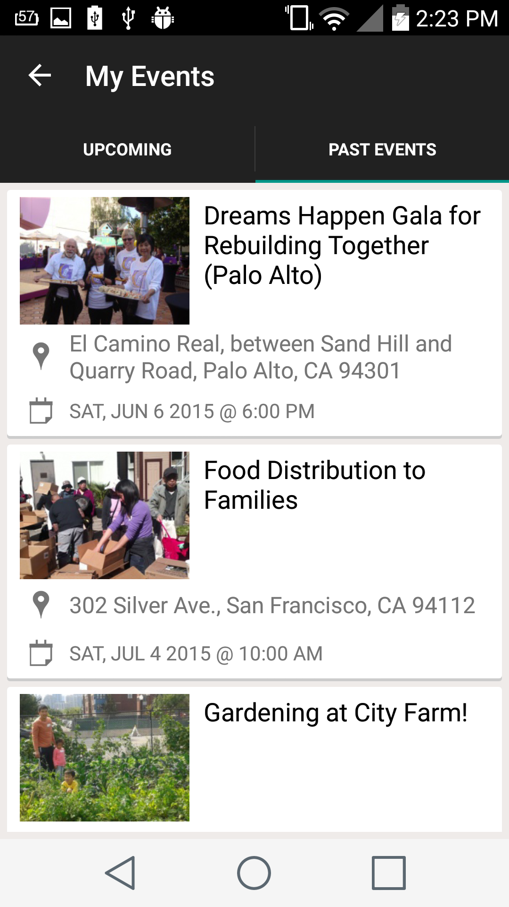

About OneBrick
===============
One Brick provides support to local non-profit and community organizations by creating a unique, social and flexible volunteer environment for those interested in making a concrete difference in the community. We enable people to get involved, have an impact and have fun, without the requirements of individual long-term commitments.

About The App
==================
OneBrick does not yet have any mobile application. Our goal is to prvide onebrick users/volunteers with android mobile application.

User Stories
==============

### Events:
* Select Chapter (Location)
* Display a list of events of a selected chapter
* Search for events
* Tap to see details of an event 

### Event Details:
* Show events for selected chapter or current location 
* Event RSVP and Un-RSVP
* Request log in if not logged in / Sign up
* Display event location
* Show contacts to reach out to even organizers
* Share event details to others

### My Events:
* Show future and past events of mine
* Show event details of mine

## Screen captures of OneBrick app
### Select a chapter

### Event list 

### Event details 

### Event search

### My Events 

